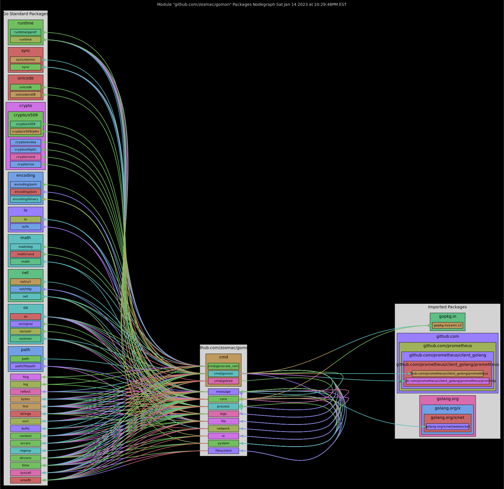

# Welcome to *Godep*: *Go* module package *dep*endency graph

- [Welcome to *Godep*: *Go* module package dependency graph](#welcome-to-godep-go-module-package-dependency-graph)
- [Overview](#overview)
- [Installing *Godep*](#installing-godep)
- [Using *Godep*](#using-godep)
- [Notices](#notices)

## Overview

The `godep` command parses the Go module in the current directory using the standard library's `go/ast` package. It builds a package dependency graph for the *[Graphviz](<https://graphviz.org>)* `dot` command that produces a SVG file for display.

## Installing *Godep*

The `godep` command depends on *Graphviz*. To download and install *[Graphviz](<https://graphviz.org/download/source/>)*, select a stable release, download its tar file, build, and install.

```zsh
tar xzvf =(curl -L "https://gitlab.com/api/v4/projects/4207231/packages/generic/graphviz-releases/7.0.6/graphviz-7.0.6.tar.gz")
cd graphviz-7.0.6
./configure
make
sudo make install
```

With the `dot` command in place, download and install *Godep*:

```zsh
go install github.com/zosmac/godep@latest
```

## Using *Godep*

The `godep` command takes no arguments. Set the current directory to that for a Go language module, defined by a `go.mod` file. Direct the standard output to a SVG file and open in a browser.

```zsh
() {
  godep >$1
  mv $1 $1.svg
  open $1.svg
  sleep 1
  rm $1.svg
} `mktemp /tmp/XXXXXX`
```



## Notices

Copyright © 2023 The Gomon Project.
